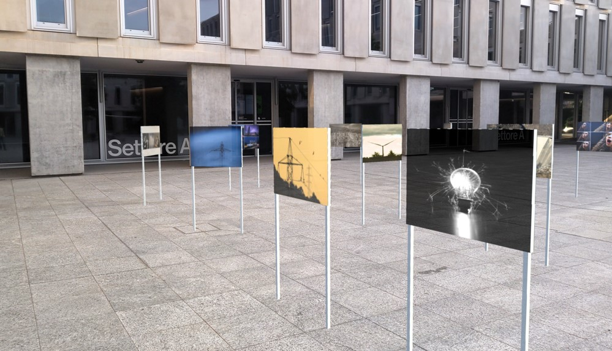
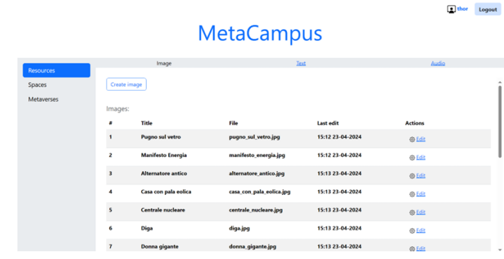

# MetaCampusSUPSI

  

**MetaCampusSUPSI** is an innovative mixed reality application developed as part of a university project. This application leverages mixed reality technologies to create a virtual exhibition space on a university campus, where users can explore images, texts, and interact with virtual resources using HoloLens 2 smart glasses.

## Overview
MetaCampus Virtual Exhibition allows users to immerse themselves in a virtual gallery, walking through an exhibition that showcases various images and texts. The application offers an interactive experience, where approaching an image triggers the playback of contextual audio narration, providing users with deeper insights and stories related to the displayed content.

## Key Features
- **Virtual Exhibition Experience**: Users can explore curated exhibitions in a fully immersive mixed reality environment using HoloLens 2 smart glasses.

- **Interactive Content with Audio Narration**: As users approach images, the application plays audio narrations that provide contextual information, enhancing the user's understanding and connection with the exhibited works.

- **Customizable Exhibitions**: Through a dedicated web interface, users can create and manage their own virtual exhibitions, customizing the displayed content, including images, texts, and associated audio, to suit their preferences or thematic needs.

## Technologies Used
- HoloLens 2
- Unity
- Mixed Reality Toolkit 3
- Spring Boot
- MySQL
- Docker